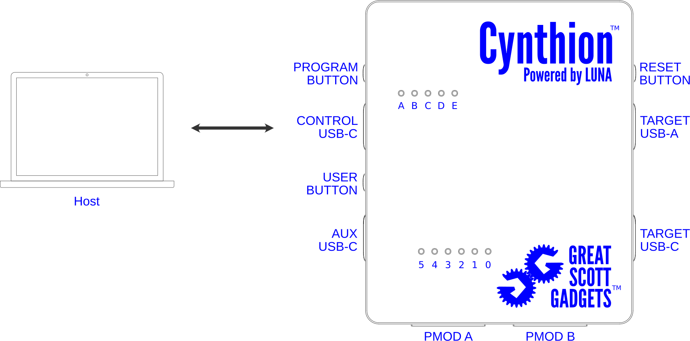

=============================
Getting Started with Cynthion
=============================

Prerequisites
-------------

To use Cynthion you will need to ensure the following software is installed:

    * `Python <https://wiki.python.org/moin/BeginnersGuide/Download>`__ v3.9, or later.

Cynthion Host Software Installation
-----------------------------------

The Cynthion host software distribution can be obtained from the `Python Package Index (PyPI) <https://pypi.org/project/cynthion/>`__ or :doc:`directly from source <developer/introduction>`.

    .. note::

        For more information on installing Python packages from PyPI please refer to the
        `"Installing Packages" <https://packaging.python.org/en/latest/tutorials/installing-packages/>`__
        section of the Python Packaging User Guide.

.. tab:: Linux

    Use `pip <https://pypi.org/project/pip/>`__ to install the Cynthion host software:

        .. code-block :: sh

            pip install cynthion

    **Install udev Rules**

    Configure your system to allow access to Cynthion for logged in users:

        .. code-block :: sh

            cynthion setup

    If you'd prefer to perform this step manually, you can download and install the rules as follows:

        .. code-block :: sh

            # download udev rules
            curl -O https://raw.githubusercontent.com/greatscottgadgets/cynthion/main/cynthion/python/assets/54-cynthion.rules

            # install udev rules
            sudo cp 54-cynthion.rules /etc/udev/rules.d

            # reload udev rules
            sudo udevadm control --reload

            # apply udev rules to any devices that are already plugged in
            sudo udevadm trigger

    You can check that the rules are installed correctly with:

        .. code-block :: sh

            cynthion setup --check

.. tab:: macOS

    Use `Homebrew <https://brew.sh/>`__ to install Python and libusb:

        .. code-block :: sh

            brew install python libusb

    Use `pip <https://pypi.org/project/pip/>`__ to install the Cynthion host software:

        .. code-block :: sh

            pip install cynthion

        .. note::

            The Cynthion host software uses the ``libusb1`` Python package to communicate with the hardware. On macOS, the package does not install the native dynamic library with it, so it's necessary to install the ``libusb`` native library through Homebrew, MacPorts or some other route.

            If you are not using a Python distribution from Homebrew you may be able to direct Cynthion to the correct location by explicitly setting ``DYLD_FALLBACK_LIBRARY_PATH`` to the location of the ``libusb`` native library.

            For example:

                .. code-block :: sh

                    DYLD_FALLBACK_LIBRARY_PATH="/opt/homebrew/lib" cynthion info

.. tab:: Windows

    Use `pip <https://pypi.org/project/pip/>`__ to install the Cynthion host software:

        .. code-block :: sh

            pip install cynthion

Test Installation
-----------------

Connect Hardware
^^^^^^^^^^^^^^^^

- Connect the Host computer to the Cynthion **CONTROL** port.
- Check that the :ref:`LED A power-on indicator <hardware/device_overview:Top View>` lights up.

Test Hardware Connectivity
^^^^^^^^^^^^^^^^^^^^^^^^^^

Open a terminal and confirm that everything is working by running:

    .. code-block :: sh

        cynthion info --force-offline

If everything is working you will see the following output:

    .. code-block :: text

        Found Cynthion device!
            Hardware: Cynthion r1.4
            Manufacturer: Great Scott Gadgets
            Product: Cynthion Apollo Debugger
            Serial number: xxxxxxxxxxxxxxxxxxxxxxxxxx
            Vendor ID: 1d50
            Product ID: 615c
            bcdDevice: 0104
            Firmware version: v1.0.6
            USB API version: 1.1
            Flash UID: xxxxxxxxxxxxxxxx

Updating Cynthion Host Software
-------------------------------

To update the Cynthion host software to the latest version run:

    .. code-block :: sh

        pip install --upgrade cynthion

Updating Cynthion Microcontroller Firmware and FPGA configuration flash
-----------------------------------------------------------------------

To upgrade the Cynthion Microcontroller firmware and FPGA configuration flash to the latest versions run:

    .. code-block :: sh

        cynthion update

You can update the Microcontroller firmware separately with:

    .. code-block :: sh

        cynthion update --mcu-firmware

You can update the FPGA configuration flash separately with:

    .. code-block :: sh

        cynthion update --bitstream
