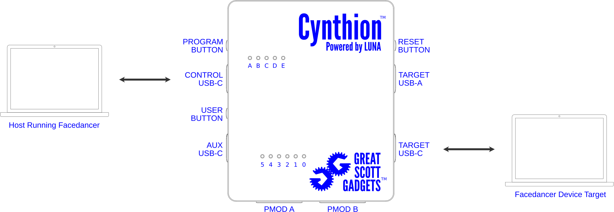

==============================
Using Cynthion with Facedancer
==============================

Before proceeding, please ensure you have completed all steps in the :doc:`getting_started` section.

Install the Facedancer library
------------------------------

You can install the Facedancer library from the `Python Package Index (PyPI) <https://pypi.org/project/facedancer/>`__, a `release archive <https://github.com/greatscottgadgets/Facedancer/releases>`__ or directly from `source <https://github.com/greatscottgadgets/Facedancer/>`__.

Install From PyPI
^^^^^^^^^^^^^^^^^

You can use the `pip <https://pypi.org/project/pip/>`__ tool to install the Facedancer library from PyPI using the following command:

.. code-block :: sh

    pip install facedancer

For more information on installing Python packages from PyPI please refer to the `"Installing Packages" <https://packaging.python.org/en/latest/tutorials/installing-packages/>`__ section of the Python Packaging User Guide.

Install From Source
^^^^^^^^^^^^^^^^^^^

.. code-block :: sh

    git clone https://github.com/greatscottgadgets/facedancer.git
    cd facedancer/

Once you have the source code downloaded you can install the Facedancer library with:

.. code-block :: sh

    pip install .

Load Facedancer Bitstream and Firmware
--------------------------------------

You can load the Facedancer Bitstream and Firmware by running:

.. code-block :: sh

    `cynthion program TODO`

To put Cynthion back into analyzer mode you can run:

.. code-block :: sh

    `cynthion program TODO`

You can verify that everything is working by running:

.. code-block :: sh

    cynthion info

You should see output like:

.. code-block :: sh

    TODO cynthion info output when running as moondancer

Connect Hardware
----------------

Make sure that the target host is running a program that can receive keyboard input such as a terminal or text editor and that it has focus.

Run a Facedancer example
------------------------

Create a new Python file called ``rubber-ducky.py`` with the following content:

.. literalinclude:: ../../cynthion/python/examples/facedancer-rubber-ducky.py
   :language: python
   :linenos:

Open a terminal and run:

.. code-block :: sh

    python ./rubber-ducky.py

If all goes well, you should see the string ``hello, facedancer`` typed into the target host.

More Information
----------------

For further information, see the `Facedancer documentation <https://facedancer.readthedocs.io/>`_.
