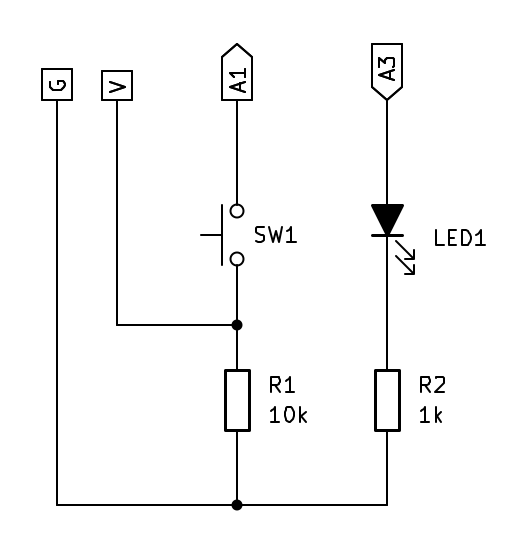
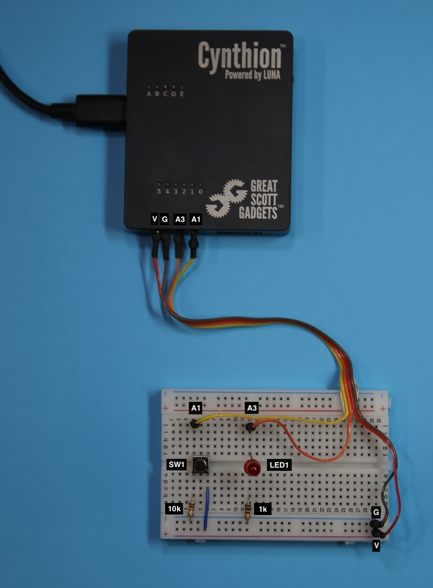

=======================================
Using Cynthion USER I/O with Facedancer
=======================================

In addition to the four USB ports Cynthion also includes the following user i/o ports:

* :ref:`USER Button <hardware/device_overview:Left View>`
* :ref:`USER PMOD A & B <hardware/device_overview:Front View>`
* :ref:`USER LEDs <hardware/device_overview:Top View>`

Apart from PMOD B, which is used for the Facedancer SoC UART and JTAG interface, all of these can be accessed from within Python Facedancer devices.

Before proceeding, please ensure you have completed all steps in the :doc:`getting_started` and :doc:`getting_started_facedancer` sections.

Requirements
------------

* A Cynthion running the Facedancer bitstream.
* Two USB Cables.

Using Cynthion APIs
-------------------

To access Cynthion USER i/o using Python you first need an instance of the ``Cynthion`` object, which can be created as follows:

.. code-block :: python

    from cynthion import Cynthion
    c = Cynthion()

Once you have a ``Cynthion`` instance you will be able to access USER i/o using the ``leds`` and ``gpio`` APIs.

For example, open a new Python shell:

.. code-block :: sh

    $ python

    Python 3.11.11 (main, Feb 12 2025, 14:40:14) [Clang 16.0.0 (clang-1600.0.26.6)] on darwin
    Type "help", "copyright", "credits" or "license" for more information.
    >>>

First obtain a ``Cynthion`` instance:

.. code-block :: python

    >>> from cynthion import Cynthion
    >>> c = Cynthion()

Turn on USER Led5:

.. code-block :: python

    >>> c.leds[5].on()

Turn off USER Led5:

.. code-block :: python

    >>> c.leds[5].off()

Toggle USER Led4:

.. code-block :: python

    >>> c.leds[4].toggle()

Get the USER Button:

.. code-block :: python

    >>> user_button = c.gpio.get_pin("USER")

Wait for the USER Button to be pressed: (hit enter twice to start)

.. code-block :: python

    >>> while user_button.read() == False: pass
    ...

Using USER Button and Leds with Facedancer
------------------------------------------

Lets modify the Facedancer rubber-ducky example to give us a bit more information and control using Cynthion USER i/o. We'll subclass a Facedancer device and add some calls to the USER i/o APIs in response to host requests and device responses.

Create a new Python file called ``facedancer-user-io.py`` and add the following content:

.. literalinclude:: ../../cynthion/python/examples/facedancer-user-io.py
    :caption: facedancer-user-io.py
    :language: python
    :linenos:

Open a terminal and run:

.. code-block :: sh

    python ./facedancer-user-io.py

If everything went well you should see prompts at various points to press the USER button to continue execution as well as the USER Leds flashiing in response to device events.

USER Pmod inputs and outputs
----------------------------

In addition to the USER Button and Leds, Facedancer can also make use of Cynthion USER Pmod A (USER Pmod B is used for JTAG and UART duties) to trigger or respond to external hardware. They use the same ``gpio`` APIs as the USER Button but individual pins can also be configured as inputs or outputs.

Let's build a simple example that uses two of the USER Pmod A pins to connect a switch and a LED to Cynthion.

You will need:
^^^^^^^^^^^^^^

* 1x SPST Switch
* 1x 1 kOhm resistor
* 1x 10 kOhm resistor
* 1x LED
* 1x Breadboard

Circuit Diagram
^^^^^^^^^^^^^^^

Breadboard Layout
^^^^^^^^^^^^^^^^^

Source Code
^^^^^^^^^^^

Create a new Python file called ``cynthion-user-pmod.py`` with the following content:

.. code-block :: python
    :caption: cynthion-user-pmod.py
    :linenos:

    import time

    from cynthion import           Cynthion
    from cynthion.interfaces.gpio  import PinDirection

    # Get Cynthion instance
    c = Cynthion()

    # Get USER Pmod Pin A1 and configure it as an input
    a1 = c.gpio.get_pin("A1")
    a1.set_direction(PinDirection.Input)

    # Get USER Pmod Pin A3 and configure it as an output
    a3 = c.gpio.get_pin("A3")
    a3.set_direction(PinDirection.Output)

    # Continuously read the input value of Pin A1 and output it to Pin A3.
    while True:
        value = a1.read()
        a3.write(value)
        time.sleep(0.1)

Open a terminal and run:

.. code-block :: sh

    python ./cynthion-user-pmod.py

If all goes well, the LED should light up when you press the switch and turn off when you release it.
