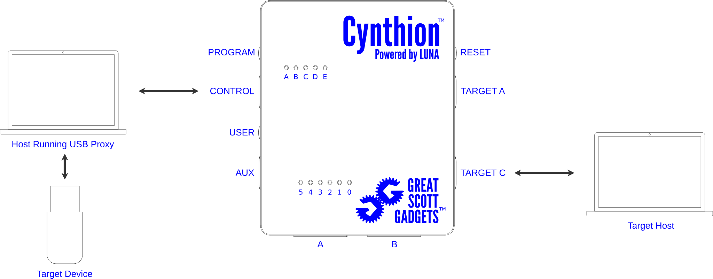

=============================
Using Cynthion with USB Proxy
=============================

.. warning::

   USBProxy is not currently supported on Windows. Attempting to use USB Proxy on Windows may cause USB analysis to stop working.

   For more information please see the tracking issue: `#170 <https://github.com/greatscottgadgets/cynthion/issues/170>`__

Before proceeding, please ensure you have completed all steps in the :doc:`getting_started` and :doc:`getting_started_facedancer` sections.

Connect Hardware
----------------

Run a USB Proxy example
-----------------------

Create a new Python file called ``usbproxy.py`` with the following content:

.. literalinclude:: ../../cynthion/python/examples/facedancer-usbproxy.py
   :language: python
   :linenos:

Open a terminal and run:

.. tab:: Linux

    .. code-block :: sh

        python ./usbproxy.py

.. tab:: macOS

    .. note::

       USBProxy requires root privileges on macOS in order to claim the device being proxied from the operating system.

    .. code-block :: sh

        sudo python ./usbproxy.py

If all goes well you should see the output from device enumeration in your terminal and the proxied USB device should be detected by the target computer.

More Information
----------------

For further information, see the `Facedancer USB Proxy documentation <https://facedancer.readthedocs.io/en/latest/using_usb_proxy.html>`_.
