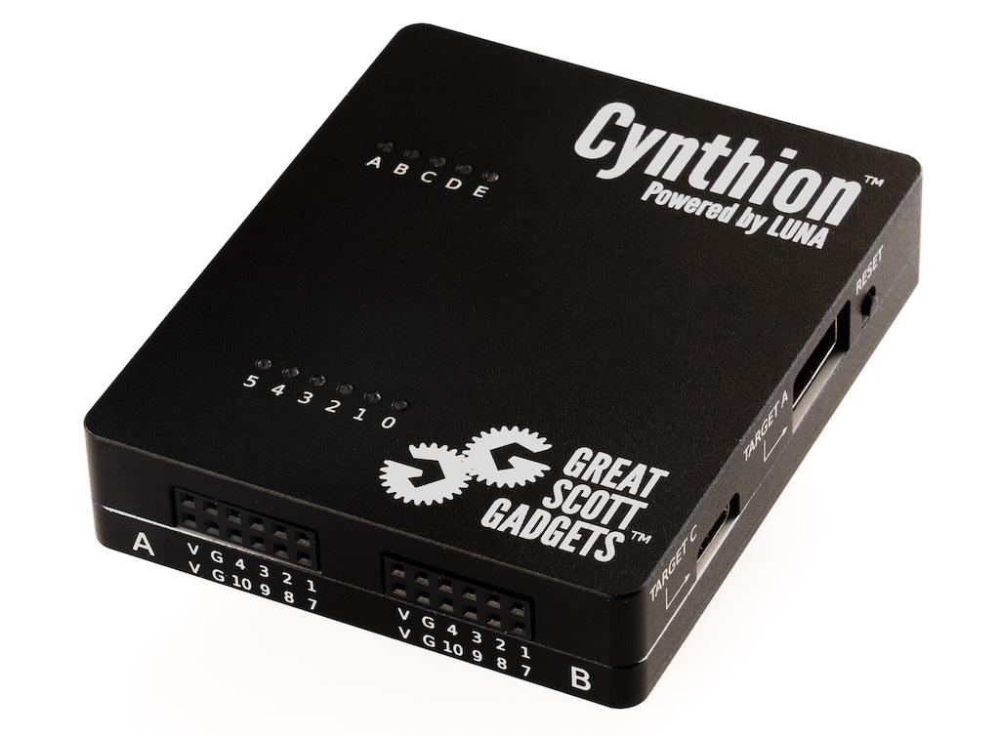

======================
Cynthion Documentation
======================

.. toctree::
  :maxdepth: 2
  :caption: User Documentation

  project_description
  getting_started
  getting_started_packetry
  getting_started_facedancer
  getting_started_usbproxy
  cli

.. toctree::
  :maxdepth: 2
  :caption: Tutorials

  tutorials/usb_analysis
  tutorials/emulation
  tutorials/gateware_blinky
  tutorials/gateware_usb_device_01
  tutorials/gateware_usb_device_02
  tutorials/gateware_usb_device_03
  tutorials/gateware_usb_device_04

.. toctree::
  :maxdepth: 2
  :caption: Cynthion Hardware

  hardware/introduction
  hardware/device_overview
  hardware/bringup_guide
  hardware/cli

.. toctree::
  :maxdepth: 2
  :caption: Support

  support/getting_help
  support/project_mentions
  support/safety_information

.. toctree::
  :maxdepth: 2
  :caption: Developer Documentation

  developer/introduction
  developer/bitstream_generation
  developer/soc_firmware_compilation
