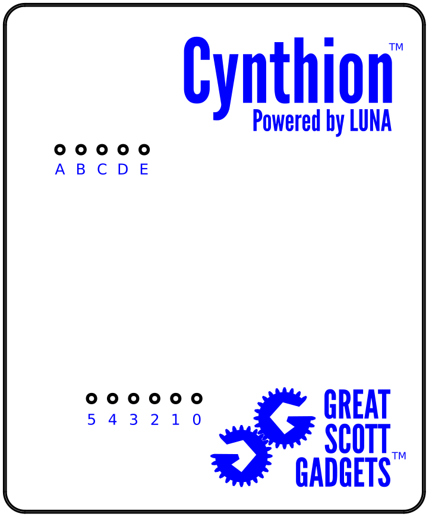
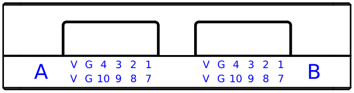

============
Introduction
============

What is Cynthion?
-----------------

Cynthion is an all-in-one tool for building, testing, monitoring, and experimenting with USB devices. Built around a unique FPGA-based architecture, Cynthion’s digital hardware can be fully customized to suit the application at hand. As a result, it can act as a no-compromise High-Speed USB protocol analyzer, a USB-hacking multi-tool, or a USB development platform.

Out-of-the-box, Cynthion acts as a USB protocol analyzer capable of capturing and analyzing traffic between a host and any Low-, Full-, or High-Speed ("USB 2.0") USB device. It works seamlessly with our open-source analysis software.

Combined with our LUNA gateware and Facedancer libraries, Cynthion becomes a versatile USB-hacking and development tool. Facedancer makes it quick and easy to create or tamper with real USB devices—not just emulations—even if you don’t have experience with digital-hardware design, HDL, or FPGA architecture!

Top View
~~~~~~~~

Left View
~~~~~~~~~

- **PROGRAM BUTTON** - Puts Cynthion into DFU mode for firmware updates.
- **CONTROL USB-C**  - Primary USB connector used by the host computer to control Cynthion.
- **USER BUTTON**    - A user-assignable button that can be used in your own designs.
- **AUX USB-C**      - An auxillary USB connection that can be used in your own designs.

Right View
~~~~~~~~~~

- **TARGET USB-C** - USB Type-C connector for Packetry traffic capture and Facedancer device emulation.
- **TARGET USB-A** - USB Type-A connector shared with the TARGET USB-C connector.
- **RESET BUTTON** - Cynthion hardware reset button.

Front View
~~~~~~~~~~

- **PMOD A & B** - Digilent Pmod™ Compatible I/O connector with a total of 16 high-speed FPGA user IOs.

**PMOD B** can also be configured to act as a serial port and JTAG connector for debugging SoC designs.

Bottom View
~~~~~~~~~~~

.. image:: ../images/cynthion-bottom.svg
  :width: 400
  :alt: Cynthion Bottom View
