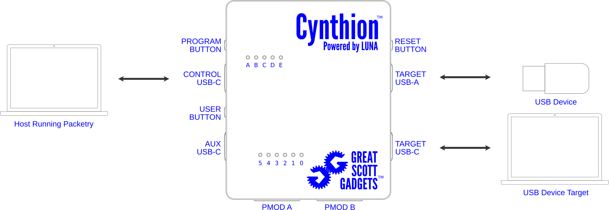
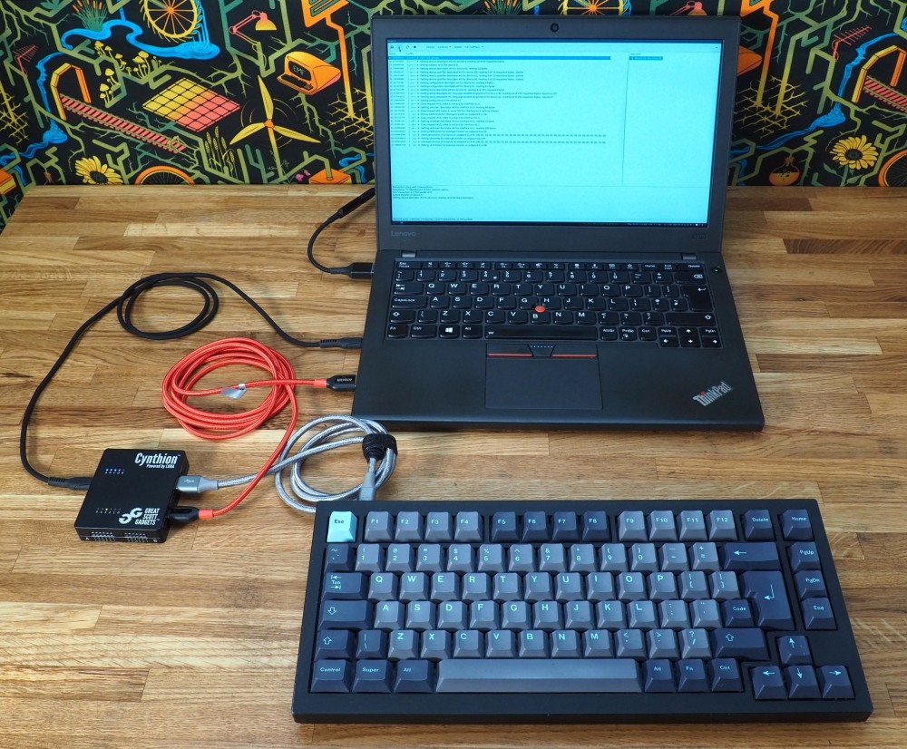
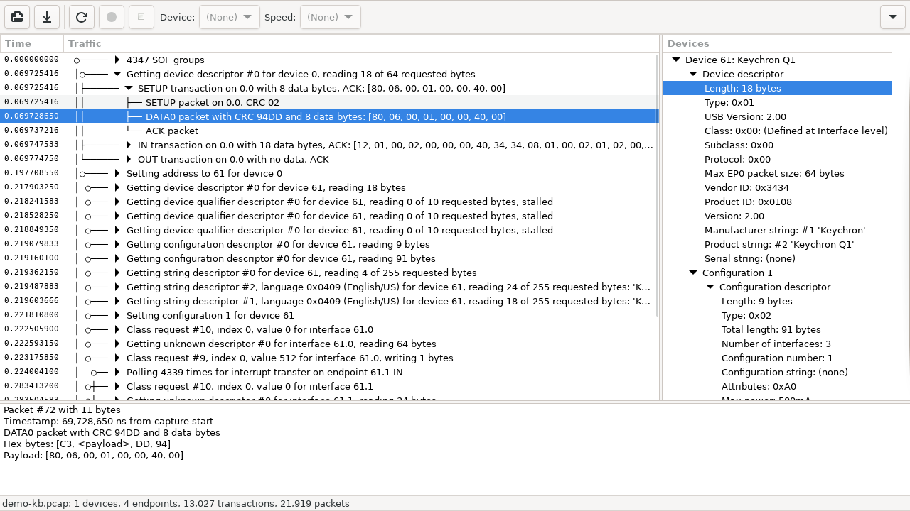
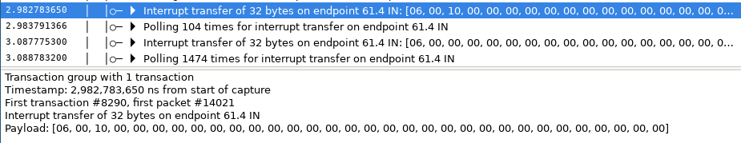
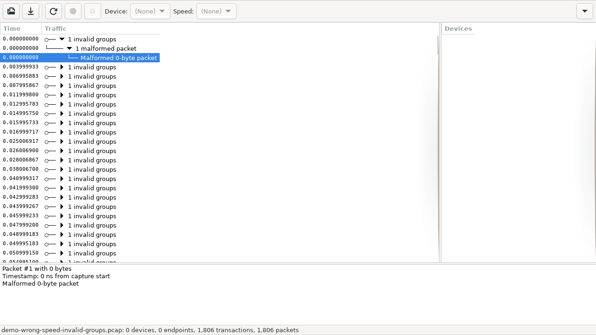
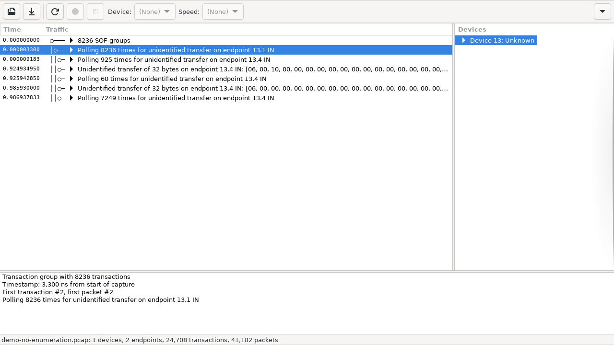

Protocol analysis of a USB keyboard
===================================

This tutorial walks through the whole process of running a USB protocol capture of a target device, in this case a keyboard. Hopefully most people have a USB keyboard available and can follow along,
though this process is also applicable to any USB peripheral device.

Prerequisites
-------------

 * Install the Cynthion tools by following :doc:`getting_started`
 * Install Packetry by following `Getting Started with Packetry <https://packetry.readthedocs.io/en/latest/quick_start.html>`_
 * Run the analyzer gateware on Cynthion by following :doc:`getting_started_packetry`

Determine device speed
----------------------

USB 2.0 supports three different speeds: Low (1.5 Mbit/s), Full (12 Mbit/s), and High (480 Mbit/s).
The analyzer needs to know what speed to expect, so we need to detemine what speed the target device is using.

    .. note::

        Soon this step won't be necessary, as the analyzer will be able to determine the speed automatically,
        but that feature is currently in development.

To determine the speed, we plug the target device into a host check what speed it reports. The way to check depends on the host operating system:

.. tab:: Linux

    Run the command ``sudo dmesg -W`` in a terminal window and then plug the target device in, some new lines should show up with information about it::

        [975321.743878] usb 1-6.1: new full-speed USB device number 12 using xhci_hcd
        [975321.821329] usb 1-6.1: New USB device found, idVendor=3434, idProduct=0108, bcdDevice= 2.00
        [975321.821341] usb 1-6.1: New USB device strings: Mfr=1, Product=2, SerialNumber=0
        [975321.821345] usb 1-6.1: Product: Keychron Q1
        [975321.821348] usb 1-6.1: Manufacturer: Keychron

    Here, it shows that the target device has enumerated at full-speed.

.. tab:: macOS

    Go to the Apple menu -> About This Mac -> More Info -> System Report -> Hardware -> USB. Highlight the target device and check the Speed field.

.. tab:: Windows

    The easiest way to look at USB device information on Windows is to install and run `USBView <https://learn.microsoft.com/en-us/windows-hardware/drivers/debugger/usbview>`_,
    then find the target device and check its `Device Bus Speed` field.

Connect
-------

Next, we'll connect everything up for capture. Within the Cynthion hardware the **TARGET C** and **TARGET A** ports are connected together,
and the analyzer gateware will capture any packets that are seen going between those ports. These packets are then sent out through the **CONTROL** port.

First, connect the **CONTROL** port to the host that will be running Packetry. Next, connect the **TARGET C** port to a host.
This can be a different host from the one running Packetry, or it can be the same host. If it is the same host, the two connections must not be on the same hub.

The **TARGET A** port will connect to the target device, but for now we leave it disconnected.

Capture
-------

Open Packetry. At the top of the window, you should see the `action bar <https://packetry.readthedocs.io/en/latest/user_interface.html#action-bar>`_:

.. image:: ../images/tutorial_usb_analysis/action_bar.png
  :alt: Action Bar

Select the correct speed, press the capture button (the filled circle), and plug in the target device. The cable connections should look like this:

Upon plugging in the target device, a collection of entries should show up in the Traffic Pane, these show the requests that a host makes to find out information about a new device (known as USB enumeration).

The target device should also show up in the `Devices` pane to the right. All of the entries in the Traffic and Device panes can be expanded for more detail, by clicking on the black triangles.
Clicking on an entry in the Traffic pane to highlight it will show extra detail in the pane below.

If you press and release a key on the keyboard, some new entries should show up:

Here I pressed the ``a`` key, causing two interrupt transfers; one for the press and one for the release event.
If you want to go further, you could look at the `USB human interface device class (HID) specification <https://usb.org/document-library/device-class-definition-hid-111>`_,
to learn about the class-specific descriptors and endpoints, and match up what you see on the bus to keypress events.

Troubleshooting
---------------

Below are some common issues you may run into, with some advice for resolving them. If you run into further issues, please see the :doc:`support/getting_help` section for more support.

Capture button is grayed out and no capture device shows up in Packetry
^^^^^^^^^^^^^^^^^^^^^^^^^^^^^^^^^^^^^^^^^^^^^^^^^^^^^^^^^^^^^^^^^^^^^^^

* Double check that the Cynthion **CONTROL** port is connected to the host running Packetry.
* Check that the cable is good, ideally trying it with another USB device that transfers data (not just charging).
* Make sure that the analyzer gateware is running on the Cynthion device by following :doc:`getting_started_packetry`.

No traffic shows up during capture
^^^^^^^^^^^^^^^^^^^^^^^^^^^^^^^^^^

First, make sure the target device is operating correctly. If following along with a keyboard, make sure that any keypresses get through to the target host.
If traffic still isn't showing up, this is usually caused by selecting the wrong capture speed, try capturing with each of the other two speed options.

Traffic shows "Invalid Groups"
^^^^^^^^^^^^^^^^^^^^^^^^^^^^^^

This means that the analyzer is detecting packets that are invalid. This is usually caused by selecting the wrong capture speed, try capturing with each of the other two speed options.

Traffic shows "unidentified transfer" and Devices shows an "Unknown" device
^^^^^^^^^^^^^^^^^^^^^^^^^^^^^^^^^^^^^^^^^^^^^^^^^^^^^^^^^^^^^^^^^^^^^^^^^^^

This means that valid packets have been captured, but Packetry did not see the target device enumeration so it doesn't have enough information to fully decode the USB transactions/transfers.
If you would like to see the full decoding, make sure to start the capture in Packetry before plugging in the target device.
