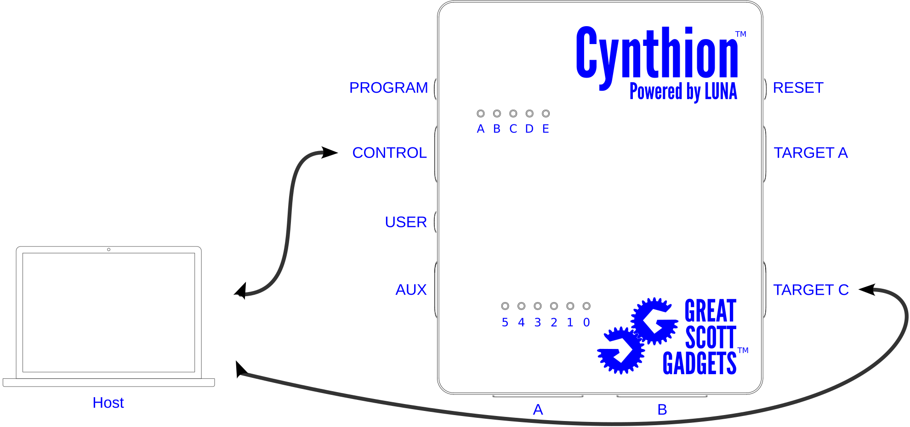

USB Gateware: Part 1 - Enumeration
##################################

This series of tutorial walks through the process of implementing a complete USB device with Cynthion and `LUNA <https://luna.readthedocs.io/>`__:

* :doc:`/tutorials/gateware_usb_device_01` *(This tutorial)*
* :doc:`/tutorials/gateware_usb_device_02`
* :doc:`/tutorials/gateware_usb_device_03`
* :doc:`/tutorials/gateware_usb_device_04`

The goal of this tutorial is to create a gateware design for the simplest USB Device that can still be enumerated by a host.

Prerequisites
=============

 * Install the Cynthion tools by following :doc:`/getting_started`.
 * Complete the :doc:`/tutorials/gateware_blinky` tutorial.

Define a USB Device
===================

USB devices are defined using a hierarchy of descriptors that contain information such as:

* The product name and serial number.
* The vendor who made it.
* The class of device it is.
* The ways in which it can be configured.
* The number and types of endpoints it has.

At the root of this hierarchy lies the *Device Descriptor* and a device can only have one.

Create the Device Descriptor
----------------------------

Create a new file called ``gateware-usb-device.py`` and add the following code to it:

.. code-block :: python
    :caption: gateware-usb-device.py
    :linenos:

    from amaranth               import  *
    from usb_protocol.emitters  import  DeviceDescriptorCollection

    VENDOR_ID  = 0x1209 # https://pid.codes/1209/
    PRODUCT_ID = 0x0001

    class GatewareUSBDevice(Elaboratable):
        def create_descriptors(self):
            descriptors = DeviceDescriptorCollection()

            with descriptors.DeviceDescriptor() as d:
                d.idVendor           = VENDOR_ID
                d.idProduct          = PRODUCT_ID
                d.iManufacturer      = "Cynthion Project"
                d.iProduct           = "Gateware USB Device"
                d.bNumConfigurations = 1

            return descriptors

        def elaborate(self, platform):
            m = Module()
            return m

We have now created a minimal device descriptor with a `vendor id <https://pid.codes/1209/>`__, product id, a manufacturer, a product description and one *Configuration Descriptor*.

USB devices can have multiple configurations but only one can be active at a time. This allows a USB device to be configured differently depending on the situtation. For example, a device might be configured differently if it's bus-powered vs self-powered.

Create the Configuration Descriptor
-----------------------------------

Next, add a configuration descriptor for our device by adding the highlighted lines:

.. code-block :: python
    :caption: gateware-usb-device.py
    :linenos:
    :emphasize-lines: 18-20

    from amaranth               import *
    from usb_protocol.emitters  import DeviceDescriptorCollection

    VENDOR_ID  = 0x1209 # https://pid.codes/1209/
    PRODUCT_ID = 0x0001

    class GatewareUSBDevice(Elaboratable):
        def create_descriptors(self):
            descriptors = DeviceDescriptorCollection()

            with descriptors.DeviceDescriptor() as d:
                d.idVendor           = VENDOR_ID
                d.idProduct          = PRODUCT_ID
                d.iManufacturer      = "Cynthion Project"
                d.iProduct           = "Gateware USB Device"
                d.bNumConfigurations = 1

            with descriptors.ConfigurationDescriptor() as c:
                with c.InterfaceDescriptor() as i:
                    i.bInterfaceNumber = 0

            return descriptors

        def elaborate(self, platform):
            m = Module()
            return m

We have now created the descriptors for a device with a single configuration descriptor and one interface descriptor with no endpoints. (We'll add some endpoints later!)

.. note::

   Each USB Configuration can have multiple interface descriptors and
   they can all be active at the same time. This allows a USB device
   to create functional groups that are each responsible for a single
   function of the device. For example, a USB Audio Interface may have
   one interface descriptor with two endpoints for audio input/output
   and another interface descriptor with one endpoint for MIDI input.

Create Device Gateware
----------------------

Now that we have defined our device's descriptors we need to create the interface between our device's physical USB port and the gateware that implements the device's function(s). Fortunately the LUNA library takes care of all the hard work for us and we only need to add the following lines:

.. code-block :: python
    :caption: gateware-usb-device.py
    :linenos:
    :emphasize-lines: 28-40, 44-

    from amaranth               import *
    from luna.usb2              import USBDevice
    from usb_protocol.emitters  import DeviceDescriptorCollection

    VENDOR_ID  = 0x1209 # https://pid.codes/1209/
    PRODUCT_ID = 0x0001

    class GatewareUSBDevice(Elaboratable):
        def create_descriptors(self):
            descriptors = DeviceDescriptorCollection()

            with descriptors.DeviceDescriptor() as d:
                d.idVendor           = VENDOR_ID
                d.idProduct          = PRODUCT_ID
                d.iManufacturer      = "Cynthion Project"
                d.iProduct           = "Gateware USB Device"
                d.bNumConfigurations = 1

            with descriptors.ConfigurationDescriptor() as c:
                with c.InterfaceDescriptor() as i:
                    i.bInterfaceNumber = 0

            return descriptors

        def elaborate(self, platform):
            m = Module()

            # configure cynthion's clocks and reset signals
            m.submodules.car = platform.clock_domain_generator()

            # request the physical interface for cynthion's TARGET C port
            ulpi = platform.request("target_phy")
            m.submodules.usb = usb = USBDevice(bus=ulpi)

            # create our descriptors and add them to the device's control endpoint
            descriptors = self.create_descriptors()
            control_ep = usb.add_standard_control_endpoint(descriptors)

            # configure the device to connect by default when plugged into a host
            m.d.comb += usb.connect.eq(1)

            return m

    if __name__ == "__main__":
        from luna import top_level_cli
        top_level_cli(GatewareUSBDevice)

Testing the Device
==================

Connect
-------

We need to connect our Cynthion before we can test our new USB device. If you followed the prerequisites above, you should already have connected the Cynthion's **CONTROL** port to your computer.

Now also connect the **TARGET C** port to your computer as this is the port we requested our USB Device to run on. The control host and target host can be two separate computers, but in this tutorial we will use the same computer as both the control host and the target host.

Build
-----

Build the device gateware and upload it to your Cynthion by typing the following into your terminal shell:

.. code-block :: sh

    python ./gateware-usb-device.py

If everything went well and Cynthion's **TARGET C** port is connected we should now be able to check if the target host managed to succesfully enumerate our device.

Test
----

To check if the device was recognized by the target host's operating system follow the corresponding instructions:

.. tab:: Python

    Create a new file called ``test-gateware-usb-device.py`` and add the following code to it:

    .. code-block :: python
        :caption: test-gateware-usb-device.py
        :linenos:

        import usb1

        def list_available_usb_devices(context):
            for device in context.getDeviceList():
                try:
                    manufacturer = device.getManufacturer()
                    product = device.getProduct()
                    print(f"{device}:  {manufacturer} - {product}")
                except Exception as e:
                    print(f"{device}: {e}")

        if __name__ == "__main__":
            with usb1.USBContext() as context:
                list_available_usb_devices(context)

    Run the file with:

    .. code-block :: sh

        python ./test-gateware-usb-device.py

    And, if the device is recognized, you should see a line like:

    .. code-block :: sh
        :emphasize-lines: 4

        Bus 000 Device 001: ID 1d5c:5010:  Fresco Logic, Inc. - USB2.0 Hub
        Bus 000 Device 002: ID 1d5c:5000:  Fresco Logic, Inc. - USB3.0 Hub
        Bus 000 Device 003: ID 1d50:615c:  Great Scott Gadgets - Cynthion Apollo Debugger
        Bus 000 Device 007: ID 1209:0001:  Cynthion Project - Gateware USB Device

    If you're running on Windows you may instead see something like:

    .. code-block :: sh
        :emphasize-lines: 4

        Bus 000 Device 001: ID 1d5c:5010:  Fresco Logic, Inc. - USB2.0 Hub
        Bus 000 Device 002: ID 1d5c:5000:  Fresco Logic, Inc. - USB3.0 Hub
        Bus 000 Device 003: ID 1d50:615c:  Great Scott Gadgets - Cynthion Apollo Debugger
        Bus 000 Device 007: ID 1209:0001:  LIBUSB_ERROR_NOT_SUPPORTED [-12]

    The devices Product and Vendor ID's are correct (``1209:0001``) but Windows could not obtain the product or manufacturer strings. This behaviour is expected and we'll be taking a closer look at it in the next part of the tutorial.

.. tab:: Linux

    Run the following command in a terminal window:

    .. code-block :: sh

        lsusb

    If the device enumerated successfully you should see an entry similiar to the highlighted line:

    .. code-block :: sh
        :emphasize-lines: 6

        % lsusb

        Bus 001 Device 001: ID 1d6b:0002 Linux Foundation 2.0 root hub
        Bus 001 Device 003: ID 2109:2822 VIA Labs, Inc. USB2.0 Hub
        Bus 001 Device 045: ID 1d50:615c OpenMoko, Inc. Cynthion Apollo Debugger
        Bus 001 Device 046: ID 1209:0001 Generic pid.codes Test PID
        Bus 002 Device 001: ID 1d6b:0003 Linux Foundation 3.0 root hub

    To view the device's descriptors, pass the product and vendor id's by running:

    .. code-block :: sh

        lsusb -d 1209:0001 -v

.. tab:: macOS

    Run the following command in a terminal window:

    .. code-block :: sh

        ioreg -b -p IOUSB

    If the device enumerated successfully you should see an entry similiar to the highlighted line:

    .. code-block :: sh
        :emphasize-lines: 8

         % ioreg -b -p IOUSB

         +-o Root  <class IORegistryEntry, id 0x100000100, retain 30>
           +-o AppleT8103USBXHCI@00000000  <class AppleT8103USBXHCI, id 0x100000331, registered, matched, ac$
             +-o USB2.0 Hub@00100000  <class IOUSBHostDevice, id 0x1000ee65d, registered, matched, active, b$
             | +-o USB2.0 Hub@00140000  <class IOUSBHostDevice, id 0x1000ee6b0, registered, matched, active,$
             | | +-o Cynthion Apollo Debugger@00144000  <class IOUSBHostDevice, id 0x100180243, registered, $
             | +-o Gateware USB Device@00130000  <class IOUSBHostDevice, id 0x100181cb3, registered, matched$
             +-o USB3.0 Hub@00200000  <class IOUSBHostDevice, id 0x100181add, registered, matched, active, b$
               +-o USB3.0 Hub@00240000  <class IOUSBHostDevice, id 0x100181aef, registered, matched, active,$

    To view more information, pass the device name:

    .. code-block :: sh

        ioreg -b -p IOUSB -n "Gateware USB Device"

.. tab:: Windows

    The easiest way to check a USB device is to open the Windows Device Manager. However, if you try this with our device you will notice there's a small problem:

    .. image:: ../../images/tutorial_gateware_usb_device/without_wcid.png
      :alt: Gateware USB Device on Windows without WCID Descriptors.

    We can see our device, but it has a warning icon indicating that it does not have an installed device driver. Unlike macOS or Linux, Windows does not support a generic USB driver for non-class devices with custom vendor interfaces. In the next part of the tutorial we'll look at how to solve this.

Conclusion
==========

Our device can now be enumerated by a host but, if you're running Microsoft Windows, you will have noticed that the device still requires a device driver to function.

The next part of the tutorial is optional and will cover WCID Descriptors which is a mechanism introduced by Microsoft to allow Windows applications to communicate directly with USB devices without the neccessity of writing device drivers.

If you don't need to target Windows please feel free to skip the next part and jump straight to :doc:`/tutorials/gateware_usb_device_03` to learn how to add the Control Request Handlers to our device that allow it to receive and respond to control requests from the host.

Exercises
=========

1. Try changing the device descriptor information to match an existing hardware USB device. What happens?

More information
================

* `Amaranth Language & tool change documentation <https://amaranth-lang.org/docs/amaranth/>`__.
* Beyond Logic's `USB in a NutShell <https://www.beyondlogic.org/usbnutshell/usb1.shtml>`__.
* `LUNA Documentation <https://luna.readthedocs.io/en/latest/>`__

Source Code
===========

.. literalinclude:: ../../../cynthion/python/examples/tutorials/gateware-usb-device-01.py
    :caption: gateware-usb-device-01.py
    :language: python
    :linenos:

.. literalinclude:: ../../../cynthion/python/examples/tutorials/test-gateware-usb-device-01.py
    :caption: test-gateware-usb-device-01.py
    :language: python
    :linenos:
